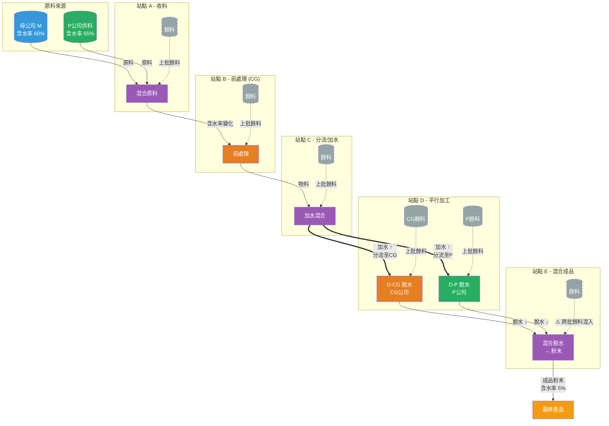

# Google AI Studio Prompt - 生成製程流程圖

## 使用方式

將以下 Prompt 完整複製到 Google AI Studio，AI 會生成 Mermaid.js 流程圖語法。

生成後可貼到 [Mermaid Live Editor](https://mermaid.live/) 查看視覺化結果。

---

## Prompt（複製以下內容）

```
You are an expert Manufacturing Systems Architect specializing in Process Flow Modeling.

Based on the following complex outsourced manufacturing process, generate a detailed Mermaid.js flowchart (using graph TD).

## Process Description

### Station A - Receiving (收料站)
- **Inputs**: Raw materials from TWO sources:
  - Mother Company (M): Supplies raw material with ~60% moisture
  - P Corporation (P): Supplies raw material with ~55% moisture
- **Process**: Materials are MIXED together at this station
- **Outputs**: Mixed raw material → Station B
- **Has Remnants**: Yes (leftover from previous batch)
- **Has Waste**: Yes

### Station B - Pre-processing (前處理站)
- **Owner**: CG Corporation (100%)
- **Inputs**: Mixed material from Station A + Remnants from previous batch
- **Process**: Pre-treatment (moisture may change)
- **Outputs**: Pre-processed material → Station C
- **Has Remnants**: Yes
- **Has Waste**: Yes

### Station C - Divergence Point with Hydration (分流/加水站)
- **Process**: 
  1. ADD WATER to the material (moisture increases significantly)
  2. SPLIT material into two parallel paths
- **Split Ratio**: Variable per batch (not fixed)
- **Outputs**:
  - Path 1 → CG Corporation's D-Line
  - Path 2 → P Corporation's D-Line
- **Has Remnants**: Yes
- **Has Waste**: Yes

### Station D - Parallel Processing (平行加工站)
Two separate lines running in parallel:

**D-CG Line (CG Corporation)**
- **Inputs**: Material from C-Path 1 + Own remnants
- **Process**: Dehydration (moisture decreases)
- **Outputs**: Semi-finished product → Station E
- **Has Remnants**: Yes
- **Has Waste**: Yes

**D-P Line (P Corporation)**
- **Inputs**: Material from C-Path 2 + Own remnants
- **Process**: Dehydration (moisture decreases)
- **Outputs**: Semi-finished product → Station E
- **Has Remnants**: Yes
- **Has Waste**: Yes

### Station E - Convergence & Final Processing (混合/成品站)
- **Critical Mixing Point**
- **Inputs**: 
  1. Output from D-CG Line
  2. Output from D-P Line
  3. Remnants from PREVIOUS BATCH of Station E (cross-batch contamination)
- **Process**: 
  1. Mixing all inputs
  2. Final dehydration → Powder (moisture ~5%)
- **Outputs**: Final powder product
- **Has Remnants**: Yes (feeds back to next batch)
- **Has Waste**: Yes

## Diagram Requirements

1. **Color Coding by Owner**:
   - Mother Company (M): Blue nodes
   - P Corporation: Green nodes
   - CG Corporation: Orange nodes
   - Mixed/Shared: Purple nodes

2. **Line Styles**:
   - Solid arrows: Normal material flow
   - Dashed arrows: Remnant loops (previous batch → current batch)
   - Thick arrows: Water addition at Station C

3. **Labels**:
   - Show moisture change direction on each arrow (↑ or ↓)
   - Mark "SPLIT" at Station C divergence
   - Mark "MERGE" at Station E convergence
   - Show "Remnant Loop" labels on dashed lines

4. **Subgraphs**:
   - Group Station D-CG and D-P in a "Parallel Processing" subgraph

5. **Special Annotations**:
   - Add a note at Station E: "Critical: Cross-batch remnant mixing"
   - Add a note at Station C: "Variable split ratio per batch"

Please generate the complete Mermaid.js code that can be directly rendered.
```

---

## 預期輸出範例

AI 應該會生成類似以下的 Mermaid 語法：


